  
  <h1>Rasika Srimal</h1>
  
<strong>Building intelligent, end-to-end data products across cloud, ML, and analytics</strong>

  
<samp>Full-stack Engineer · ML Engineer · Data Scientist &amp; Analyst</samp>

  
  

    
    
    
    
  

---

### 🧠 About

I design and deliver resilient data and AI platforms that connect real-world signals to actionable insight. From cloud-native pipelines to ML-powered applications, my work balances architecture, experimentation, and analytics so product teams can ship confidently.

### ⚙️ Core Focus Areas

- **Cloud foundations:** building secure, observable infrastructure-as-code for AWS, Azure, and GCP workloads.
- **MLOps + analytics:** operationalizing models with CI/CD, feature stores, monitoring, and experiment tracking.
- **Product acceleration:** translating ambiguous product requirements into measurable outcomes and dashboards.

### 🚀 Featured Projects

- **Cloud ML Analytics Starter** – A production-grade template stitching together data ingestion, dbt transformations, and automated ML retraining. → [View repository](https://github.com/rasikasrimal/cloud-ml-analytics-starter)
- **Customer 360 Intelligence Hub** – Customer identity resolution, propensity modeling, and reverse ETL activation from a single codebase. → [View repository](https://github.com/rasikasrimal/customer-360-intelligence)
- **Real-time Insight Workbench** – Stream processing toolkit for anomaly detection, observability, and alerting across IoT deployments. → [View repository](https://github.com/rasikasrimal/real-time-insight-workbench)

> _Case studies & deeper dives live on my [portfolio](https://rasikasrimal.vercel.app/)._ 

### 📈 Live GitHub Pulse

  

  
  

  

---

Auto-updated daily via GitHub Actions.

