  <h1>Rasika Srimal</h1>
  
  

    
  

  
<samp>Full-stack Engineer · Machine Learning · Data Science &amp; Analysis</samp>

  

    
    
    
    
  

---

<h2>Tech Stack</h2>

<h3 align="left">Languages</h3>

  
  
  
  
  

<h3 align="left">Frontend</h3>

  
  
  
  
  
  
  
  

<h3 align="left">Backend</h3>

  
  
  
  
  

<h3 align="left">Mobile</h3>

  

<h3 align="left">Data &amp; ML</h3>

  
  
  
  
  

<h3 align="left">Databases &amp; Storage</h3>

  
  
  
  
  
  

<h3 align="left">DevOps</h3>

  
  

<h3 align="left">Tools</h3>

  
  
  

---

<!-- Full-width activity graph -->

  

